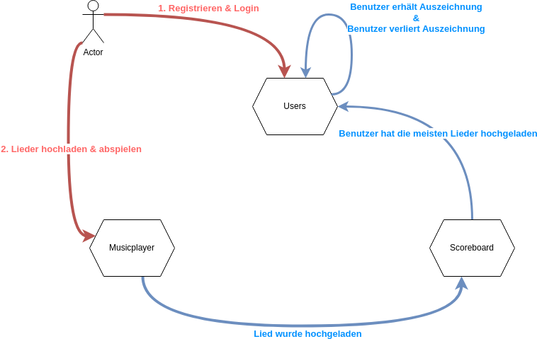

== ACME Music Player - Architecture Playground

image::.github/badges/jacoco.svg[Line Coverage]

=== Spielwiese für Architektur-Experimente

* minimal lauffähiger Prototyp mit etwas Funktionalität
* 3 Module
** ein Microservice (TODO) 
** ein Modulith mit 2 Komponenten

xref:documentation/quickstart.adoc[Quickstart Checkout + Test + Run]

xref:documentation/ADRs/adrs.adoc[Erkenntnisse/ADRs]

== Features

❓ ❌ ✅

* 3 Module/Komponenten in einem Modulithen ✅
** Users
*** Registrierung und Fake-Login (durch Registrierung implizit)
** Musicplayer
*** MP3 hochladen
*** Lieder auflisten
*** MP3 abspielen
** Scoreboard
*** Benutzer mit den meisten hochgeladenen Liedern bekommt eine "Auszeichnung"
* Cucumber basierte xref:documentation/componenttesting.adoc[Komponententests] ✅
* Datenbankmigration mit Liquibase ✅
* Java Modell Generierung mittels JOOQ ✅
** kein JPA: JOOQ-basierte Datenbankzugriffe mittels JDBC ✅
* maximal parallele, unabhängige Tests ✅
* Event Driven ✅
* Frontend mittels HTMX, Halfmoon CSS und Server Sent Events (SSE) ✅

=== Ideen

* Spring Native getestet und verworfen (siehe <<Erkenntnisse/ADRs>> ) ✅
* Modulith ✅
* paralleles Testen ✅
* Testdaten in größeren Prozessen ❓
* Events ✅
* Commands ❓
* Dokumentation ❓
* möglichst schnelles Onboarding ermöglichen ❓
* Event und Prozessdokumentation ❓
** In event Bibliothek test ob events alle in der Readme auftauchen
** In der Readme draw io Bild mit event und Prozess?
* Event Bibliothek ❓
** Inbox und outbox pattern
** Dokumentation von Event zu Service Zugehörigkeit?

=== Techstack

* Java 21
* JOOQ
* Cucumber
* Spring Boot
* Postgres
* Docker
* Playwright
* HTMX
* Halfmoon CSS

== Aufbau

== Ideen Scratchpad

=== Paralleles Testing ermöglichen ✅

. Daten nur explizit anlegen
.. UUID am Szenarioanfang im Test
... A) spezifische Testdaten: ❌
.... testdata-UUID()@testdata.local
.... testdata-UUID().mp3
... B) "Tenant" ✅
.... alle Usecase Commands um "Tenant" Parameter erweitern
..... Default "1" oder "GLOBAL"
.... Repos/Indizes nach Tenant-Id umbauen
.. in AfterAll löschen aller Testdaten anhand des Tenants ✅
... Admin-Usecase zum Löschen?

=== Modulith  ✅

. zweites Modul erstellen
. test2test kommunikation wie?
Async App Listener?
Fake Antworten/Events
. test2real == end to end test mit MessageBroker?
. Feature Test kann ja bestehen bleiben, je nach Modul andere Steps, aber Steps die für das Modul irrelevant sind -> NOOP.
Geht das?
. ArchUnit?
. Zugriff von einem Modul auf Model anderes Moduls verbieten?
. Usecase darf anderen Usecase in anderem Modul aufrufen, aber der Usecase gibt ein internes Domainobjekt zurück, ist das problematisch?
In zwei Microservices gesplittet, wäre das Objekt ein DTO und hätte keine "Extra-Logik".
Annahme: wenn aus dem Modulithen zwei Microservices werden, muss das beachtet werden.
Vermutlich werden dann die Getter einfach im Controller aufgerufen und die "Extra-Logik" findet bei der Umwandlung zum DTO für die API automatisch statt.

=== Testdaten in komplexen Fachprozessen  ❓

Wie können Tests geschrieben werden, welche sich am Ende eines komplexen fachlichen Prozesses befinden?

. Fachlich korrekte Testdatenbuilder schreiben
.. Gefahr der Re-Implementierung der Businesslogik im Testcode -> schlecht
.. Wiederverwendung von Businesslogik möglich?
.. Erzwingt Datenbankzugriff an Usecases vorbei im Testcode
... zwingende Wiederverwendung der Domain-Objekte
. Snapshot bzw.
Backup/Restore Funktionalität für ein Szenario
.. Szenario 1 laufen lassen
.. Ergebnis von Szenario 1 snappshotten
.. in Szenario 2 Snapshot wiederverwenden
.. es entstehen Abhängigkeiten zwischen den Szenarien
. Testszenarien entlang der Prozesse schneiden und nicht einzelner Features
.. Statt "MP3 abspielen", "User Einloggen" als einzelne Szenarien, ein Szenario für den Prozess des Musikabspielens "User registriert sich, user loggt sich ein, user lädt MP3 hoch, user spielt MP3 ab" in einem Szenario
.. Gegebenenfalls natürlich in sinnvoll Szenarien schneiden, wenn es zu komplex wird
... "User spielt Lied direkt ab", "User spielt Lied in Playlist ab", "User teilt Playlist mit Freunden"
