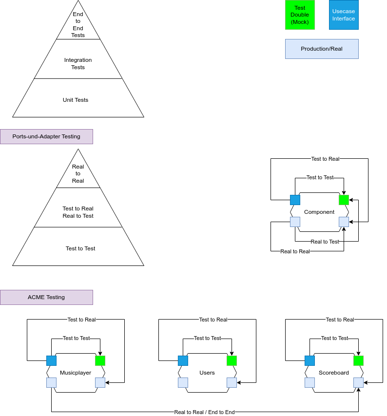

Unit Test::

https://en.wikipedia.org/wiki/Unit_testing

Unit::

From the system-requirements perspective only the perimeter of the system is relevant, thus only entry points to **externally-visible system behaviours** define units.

Typischerweise werden Systeme auch intern mit "Unittests" weitestgehend getestet:

image::unittests.drawio.png[Unittests,100%]

Richtiger wäre es nur den (fachlich relevanten) Eingang und Ausgang des Systems zu testen:

image::componenttests.drawio.png[Komponententests,100%]

INFO: ACME hat keinerlei typische Unittests, sondern Komponententests und eine sehr hohe Testabdeckung!

=== Ports und Adapter Testing Entwicklungsablauf aus dem Buch

image::testing-ports-and-adapters.png[Testing Ports and Adapters]

=== Testing bei ACME

Claims:

- Real-to-Test hat geringen Mehrwert
- Real-to-Real entspricht eher einem End-To-End Test, in einer event driven Architektur (da messbare Änderungen durch Eventverarbeitung in anderen Komponenten stattfinden)

