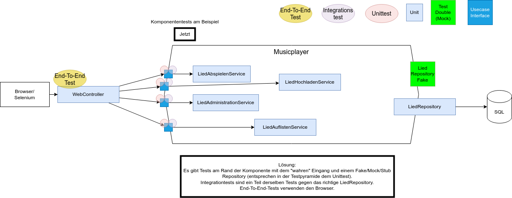

= ACME Testing Strategy - Component Testing & T2T Innovation 🧪

ACME implementiert eine experimentelle **Test-to-Test (T2T)** Strategie, die klassische Unit-Tests vollständig durch Component-Tests ersetzt.

== T2T-Strategie Überblick

**Traditionell vs.
ACME:**

* **Keine** klassischen Unit-Tests
* **Cucumber Component-Tests** als Hauptstrategie
* **Fake Adapters** statt Mocking für Business Logic Isolation
* **Tenant-Isolation** für parallele Tests

**Erreichte Metriken:**

* **>90% Code Coverage** ohne Unit-Tests
* **Vollständige Cucumber Component-Tests** für alle Use Cases

== Traditionelle vs. ACME Approach

Traditionelle Unit Tests testen oft interne Implementation-Details:

image::unittests.drawio.png[Unittests,100%]

ACME testet nur fachlich relevante Ein- und Ausgänge des Systems:

=== Ports und Adapter Testing Entwicklungsablauf aus dem Buch

== Component Test Setup

**Feature File Beispiel:**

[source,gherkin]
----
# users/users.feature
Feature: Benutzer-Registrierung
  
  Scenario: Neuer Benutzer registriert sich erfolgreich
    Given ich bin ein neuer Benutzer
    When ich mich mit Email "max@example.com" registriere
    Then sollte ich als Benutzer angelegt sein
    And ein "BenutzerRegistriertEvent" sollte publiziert werden
----

**Step Definitions:**

[source,java]
----
@SpringBootTest
@ActiveProfiles("component-test")
public class UserSteps {
    
    @Autowired
    private BenutzerAnlegenUseCase benutzerAnlegenUseCase;
    
    @Autowired 
    private FakeEventPublisher fakeEventPublisher;
    
    @When("ich mich mit Email {string} registriere")
    public void registrierung(String email) {
        benutzerAnlegenUseCase.benutzerAnlegen(
            BenutzerAnlegenCommand.builder()
                .email(email)
                .tenant(testTenant())
                .build()
        );
    }
    
    @Then("ein {string} sollte publiziert werden")
    public void eventSolltePubliziertWerden(String eventType) {
        var events = fakeEventPublisher.getEventsOfType(BenutzerRegistriertEvent.class);
        assertThat(events).hasSize(1);
    }
}
----

**Fake Adapter Implementation:**

[source,java]
----
@Component
@Profile("component-test")
public class FakeBenutzerRepository implements BenutzerRepository {
    
    private final Map<TenantId, Map<BenutzerId, Benutzer>> storage = 
        new ConcurrentHashMap<>();
    
    @Override
    public void save(Benutzer benutzer, TenantId tenant) {
        storage.computeIfAbsent(tenant, k -> new ConcurrentHashMap<>())
               .put(benutzer.getId(), benutzer);
    }
}
----

== Integration Tests

**Adapter Testing gegen echte Infrastruktur:**

[source,java]
----
@SpringBootTest
@Testcontainers
class BenutzerRepositoryIntegrationTest {
    
    @Container
    static PostgreSQLContainer<?> postgres = new PostgreSQLContainer<>("postgres:latest");
    
    @Test
    void sollte_benutzer_persistent_speichern() {
        // Given
        Benutzer benutzer = Benutzer.neu()
            .mitEmail("test@example.com")
            .erstellen();
        
        // When  
        repository.save(benutzer, TenantId.of("test-tenant"));
        
        // Then
        Optional<Benutzer> gefunden = repository.findById(
            benutzer.getId(), TenantId.of("test-tenant")
        );
        assertThat(gefunden).isPresent();
    }
}
----

== End-to-End Tests

**Playwright Browser-Automation:**

[source,java]
----
@SpringBootTest(webEnvironment = RANDOM_PORT)
class MusikspielerE2ETest extends BaseE2ETest {
    
    @Test
    void benutzer_kann_lied_hochladen_und_abspielen() {
        // Given: Anwendung läuft
        page.navigate(baseUrl);
        
        // When: Benutzer registriert sich und lädt MP3 hoch
        page.fill("#email", "musician@example.com");
        page.click("#register");
        page.setInputFiles("#mp3-upload", Paths.get("testdata/sample.mp3"));
        
        // Then: Lied erscheint und kann abgespielt werden
        assertThat(page.locator(".lied-liste")).containsText("sample.mp3");
    }
}
----

== Test-Befehle

**Component Tests:**

[source,bash]
----
# Alle Component Tests
./mvnw test -Dtest="**/*ComponentTest"

# Spezifische Cucumber Features
./mvnw test -Dcucumber.filter.tags="@musikplayer"
----

**Integration Tests:**

[source,bash]
----
# Adapter Integration Tests  
./mvnw test -Dtest="**/*IntegrationTest"

# E2E Tests (benötigt laufende App)
./mvnw test -pl e2e
----

**Coverage & Reporting:**

[source,bash]
----
# Coverage Report generieren
./mvnw clean verify jacoco:report

# Aggregierte Coverage öffnen
open jacocoreport/target/site/jacoco-aggregate/index.html
----

== Experimentelle Erkenntnisse

**✅ Erfolgreich validiert:**
* Real-to-Test hat geringen Mehrwert gegenüber Test-to-Test * Real-to-Real entspricht eher End-To-End Tests in event-driven Architektur * **Höhere Maintainability** durch fachlich orientierte Tests * Component Tests überleben Refactoring besser als Unit Tests

**Test-Struktur:**
* `componenttests/users/test2test/` - Fake-Adapter Implementierungen * `resources/features/users/` - Cucumber Features * Gemeinsame Step-Definitions für wiederkehrende Testschritte

---

💡 **Experimenteller Status:** T2T-Strategie erfolgreich validiert.
Details in xref:architecture-learnings.adoc[Architecture Learnings].
