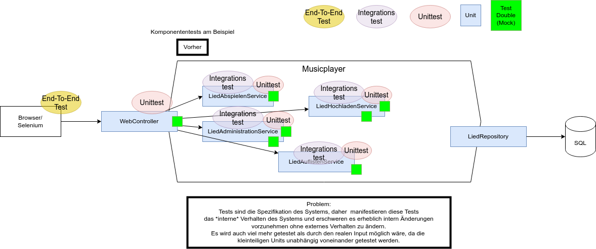

Unit Test::

https://en.wikipedia.org/wiki/Unit_testing

Unit::

From the system-requirements perspective only the perimeter of the system is relevant, thus only entry points to **externally-visible system behaviours** define units.

Typischerweise werden Systeme auch intern mit "Unittests" weitestgehend getestet:

Richtiger wäre es nur den (fachlich relevanten) Eingang und Ausgang des Systems zu testen:

image::componenttests.drawio.png[Komponententests,100%]

INFO: ACME hat keinerlei typische Unittests, sondern Komponententests und eine sehr hohe Testabdeckung!
