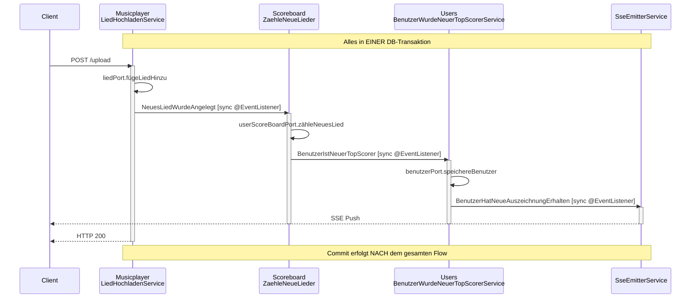
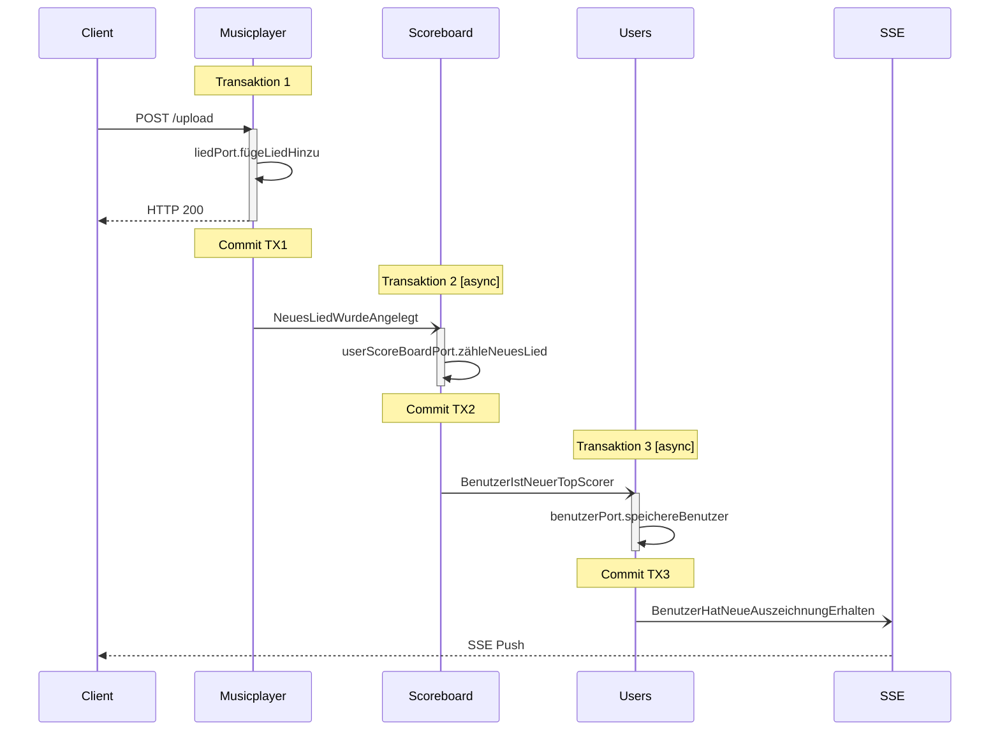
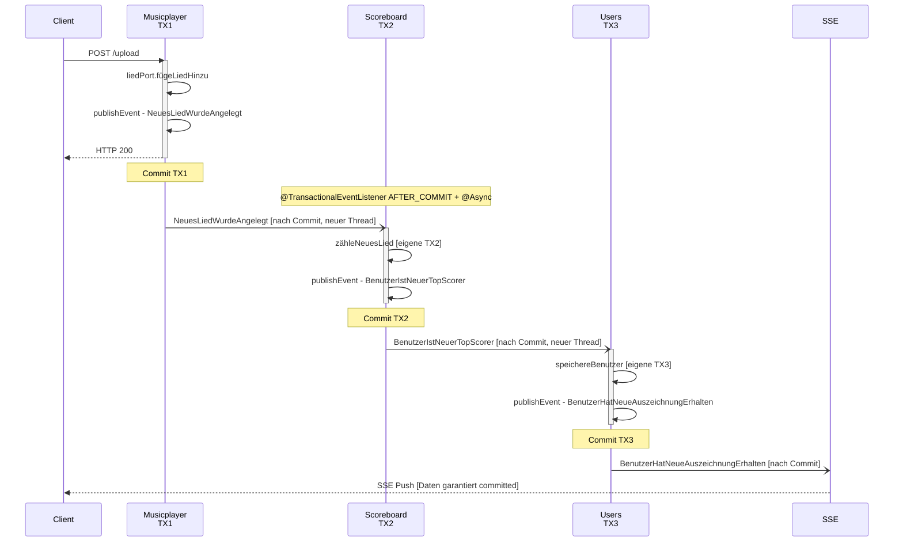

# Architektur-Diskussion: Microservices vs. Modulith für ACME

> **Status**: Die in Abschnitt 4 empfohlene Migration zu `@TransactionalEventListener + @Async` wurde am 2026-03-26 umgesetzt. Siehe [ADR-04](../ADRs/04-modulith-architektur.adoc) für die formale Entscheidungsdokumentation.

## Zusammenfassung

Dieses Dokument analysiert die aktuelle ACME-Architektur hinsichtlich Modul-Unabhängigkeit, Event-Verarbeitung und Transaktionsgrenzen. Es bewertet drei Optionen: den aktuellen synchronen Modulith, einen Modulith mit asynchronen Events und eine Microservice-Aufteilung.

---

## 1. Ist-Analyse: Wie unabhängig sind die Module wirklich?

> **Hinweis**: Diese Ist-Analyse beschreibt den Zustand **vor** der Migration zu asynchronen Events (März 2026). Der aktuelle Zustand verwendet `@TransactionalEventListener + @Async`. Siehe Abschnitt 4 und [ADR-04](../ADRs/04-modulith-architektur.adoc).

### 1.1 Modulstruktur

Die drei Module sind unter `services/acme/src/main/java/de/acme/musicplayer/components/` organisiert:

| Modul | Tabellen | Domain-Events (publiziert) |
|-------|----------|---------------------------|
| Musicplayer | `lied` | `NeuesLiedWurdeAngelegt` |
| Scoreboard | `benutzer_score_board` | `BenutzerIstNeuerTopScorer` |
| Users | `benutzer`, `benutzer_auszeichnungen` | `BenutzerHatNeueAuszeichnungErhalten`, `BenutzerHatAuszeichnungAnAnderenNutzerVerloren` |

### 1.2 Was gut gelöst ist

- **Datenisolation**: Keine Fremdschlüssel über Modulgrenzen. Jedes Modul besitzt seine Tabellen exklusiv. Die einzige FK-Beziehung (`benutzer_auszeichnungen` → `benutzer`) ist innerhalb des Users-Moduls
- **ArchUnit-Enforcement**: Module kommunizieren ausschließlich über `@ModuleApi`-annotierte Klassen. Der `ModularizationArchTest` erzwingt dies zur Compile-Zeit
- **Onion-Architektur pro Modul**: Klare Trennung in `domain/`, `ports/`, `usecases/`, `adapters/`, `configuration/`
- **Usecase-Interfaces**: Module exponieren nur Usecase-Interfaces nach außen (`exposedPackages`)
- **Shared Identity Types**: `BenutzerId`, `LiedId`, `TenantId` in `libs/common-api` — sinnvoll als Bounded-Context-übergreifende Identitäten

### 1.3 Wo die Unabhängigkeit verletzt wird

#### Compile-Time-Kopplung über Event-Typen

Die Event-Typen liegen in den jeweiligen `domain.events`-Packages und sind über `exposedPackages` zugänglich. Das bedeutet:

- **Scoreboard importiert direkt** `NeuesLiedWurdeAngelegt` aus dem Musicplayer-Modul (siehe `ScoreBoardEventListeners`, Zeile 5 und `ZaehleNeueLieder`, Zeile 5)
- **Users importiert direkt** `BenutzerIstNeuerTopScorer` aus dem Scoreboard-Modul (siehe `UserEventListeners`, Zeile 5 und `BenutzerWurdeNeuerTopScorerService`, Zeile 5)

```
Musicplayer ──[NeuesLiedWurdeAngelegt]──▶ Scoreboard ──[BenutzerIstNeuerTopScorer]──▶ Users
```

Die `@AppModule`-Annotation erlaubt dies explizit:
- Scoreboard: `allowedDependencies = {"Musicplayer", "Events", "Users", "CommonAPI"}`
- Users: `allowedDependencies = {"Musicplayer", "Events", "Scoreboard", "CommonAPI"}`

**Bewertung**: Diese Compile-Time-Kopplung über konkrete Event-Records macht eine unabhängige Deployment-Fähigkeit unmöglich. Jede Änderung an `NeuesLiedWurdeAngelegt` erzwingt ein Recompile von Scoreboard und damit auch von Users.

#### Zirkuläre allowedDependencies

Alle drei Module erlauben Abhängigkeiten auf alle anderen Module:
- Musicplayer → Users, Scoreboard
- Scoreboard → Musicplayer, Users
- Users → Musicplayer, Scoreboard

Faktisch genutzt wird nur die lineare Kette (Musicplayer → Scoreboard → Users), aber die ArchUnit-Regeln erlauben auch Rückwärts-Abhängigkeiten. Das ist ein Risiko für künftiges Wachstum.

#### Gemeinsamer EventPublisher

Alle Module nutzen dieselbe `SpringApplicationEventPublisher`-Instanz. Es gibt keinen modulspezifischen Publisher — die Bean-Namen (`musicplayerEventPublisher`, `scoreboardEventPublisher`, `userEventPublisher`) suggerieren Trennung, zeigen aber alle auf dieselbe `@Component`-Bean.

### 1.4 Event-Flow-Diagramm (Ist-Zustand)



---

## 2. Synchrone vs. Asynchrone Events

### 2.1 Aktuelle synchrone Semantik

Die gesamte Event-Kette läuft in einer einzigen DB-Transaktion:

1. `LiedHochladenService.liedHochladen()` ist `@Transactional`
2. `applicationEventPublisher.publishEvent()` ist synchron — Spring ruft alle `@EventListener`-Methoden im selben Thread auf
3. `ZaehleNeueLieder.zähleNeueAngelegteLieder()` ist `@Transactional` mit Default-Propagation `REQUIRED` → **partizipiert an der äußeren Transaktion**
4. `BenutzerWurdeNeuerTopScorerService.vergebeAuszeichnungFürNeuenTopScorer()` — ebenfalls `REQUIRED` → **gleiche Transaktion**

**Konsequenzen der synchronen Verarbeitung:**

| Eigenschaft | Auswirkung |
|-------------|------------|
| Atomarität | Alles-oder-nichts: Wenn die SSE-Benachrichtigung scheitert, wird auch das Lied-Insert zurückgerollt |
| Latenz | HTTP-Response erst nach Durchlauf der gesamten Kette (DB-Write Lied → Score-Update → Auszeichnung-Update → SSE-Send) |
| Fehler-Propagation | Eine Exception in Users (z.B. Benutzer nicht gefunden) rollt das Lied-Insert zurück |
| Kopplung | Scoreboard-Downtime verhindert Lied-Upload |

**Konkretes Problem im Code**: In `UserEventListeners.handleEvent()` wird **innerhalb der Transaktion** ein SSE-Event an den Client gesendet. Der Client erhält die Benachrichtigung **bevor** die Transaktion committed wurde. Bei einem anschließenden Rollback hat der Client eine falsche Benachrichtigung erhalten.

### 2.2 Effekt von asynchronen Events

#### Was sich ändert



#### Gewonnene Eigenschaften

- **Entkopplung**: Lied-Upload ist unabhängig von Scoreboard/Users-Verfügbarkeit
- **Geringere Latenz**: HTTP-Response sofort nach Lied-Persistierung
- **Fehler-Isolation**: Score-Fehler beeinflussen Lied-Upload nicht
- **Skalierbarkeit**: Event-Verarbeitung kann unabhängig skaliert werden

#### Neue Herausforderungen

- **Eventual Consistency**: Lied existiert, aber Score ist noch nicht aktualisiert
- **Fehlerbehandlung**: Was passiert, wenn `ZaehleNeueLieder` scheitert? Retry? Dead Letter Queue?
- **Reihenfolge**: Bei mehreren gleichzeitigen Uploads kann die Event-Reihenfolge verloren gehen
- **Idempotenz**: Retry-Mechanismen erfordern idempotente Event-Handler
- **Monitoring**: Wo steckt ein Event fest? Wie erkennt man einen fehlgeschlagenen Handler?

### 2.3 Fehlerszenarien bei Eventual Consistency

| Szenario | Aktuell - synchron | Asynchron |
|----------|-------------------|-----------|
| Lied angelegt, Score-Update scheitert | Alles wird zurückgerollt, Lied existiert nicht | Lied existiert, Score ist inkonsistent bis Retry erfolgreich |
| Benutzer existiert nicht bei Auszeichnungsvergabe | Gesamte Kette Rollback | Lied + Score ok, Auszeichnung fehlt bis manueller Eingriff |
| DB-Timeout in Scoreboard | Lied-Upload scheitert für den User | Lied-Upload erfolgreich, Score wird nachgeholt |
| Applikation crasht mitten in der Kette | Transaktion wird zurückgerollt, konsistenter Zustand | Events im Speicher gehen verloren - inkonsistenter Zustand |

### 2.4 Transactional Outbox Pattern

Das Outbox-Pattern ist **relevant** für zuverlässige asynchrone Event-Verarbeitung, aber nicht zwingend der erste Schritt:

**Aktueller Pseudo-Outbox**: `SpringApplicationEventPublisher` verwendet eine `EvictingQueue<Event>` (in-memory, max 1024 Events). Diese ist **nicht persistent** — bei Applikations-Crash gehen Events verloren. Zudem: `EvictingQueue` verwirft die ältesten Events bei Overflow ohne Warnung.

**Warum Outbox langfristig sinnvoll ist**: Ohne Outbox besteht bei einem Crash das Risiko, dass die DB-Änderung committed wurde, aber das nachfolgende async Event nie dispatcht wird. Für den aktuellen Use Case (Score-Update, Auszeichnungen) ist das Risiko tolerierbar — nach einem Restart ist der Zustand inkonsistent, aber der nächste Upload korrigiert den Top-Scorer.

**Empfehlung**: Outbox als separates, späteres Experiment betrachten. Erst die async-Umstellung mit `@TransactionalEventListener` + `@Async` durchführen und Erfahrungen sammeln. Falls Crash-Szenarien in Produktion tatsächlich zu Problemen führen, dann Outbox nachrüsten.

---

## 3. Microservices vs. Modulith mit asynchronen Events

### 3.1 Kann Entkopplung im Modulith erreicht werden?

**Ja.** Die gewünschte Entkopplung erfordert **keine** Microservices. Der empfohlene Mechanismus:

#### @TransactionalEventListener + @Async (empfohlen)

```
LiedHochladenService (@Transactional)
    └── publishEvent(NeuesLiedWurdeAngelegt)
        └── Spring: nach Commit → @TransactionalEventListener(phase = AFTER_COMMIT)
            └── @Async → neuer Thread, neue Transaktion
                └── ZaehleNeueLieder (@Transactional(propagation = REQUIRES_NEW))
```

- **Vorteil**: Minimal-invasive Änderung, kein neues Framework, nutzt rein Spring-Boot-Bordmittel
- **Vorteil**: `@EnableAsync` ist bereits in allen drei `ModuleConfiguration`-Klassen vorhanden
- **Vorteil**: Reversibel — bei Problemen können Annotationen schnell zurückgerollt werden
- **Nachteil**: Events gehen bei Crash verloren (in-memory), keine automatische Retry-Logik
- **Nachteil**: Retry und Fehlerbehandlung müssen bei Bedarf selbst implementiert werden

#### Warum nicht Spring Modulith (jetzt)

Spring Modulith bietet robustere Features (Persistent Event Publication Log, automatisches Retry, Event Externalization), bringt aber eine neue Framework-Abhängigkeit mit. Für den aktuellen Stand ist `@TransactionalEventListener` + `@Async` der pragmatischere erste Schritt. Spring Modulith bleibt als späteres Experiment auf dem Radar.

### 3.2 Zusätzliche Kosten einer Microservice-Aufteilung

| Aspekt | Modulith | 3 Microservices |
|--------|----------|-----------------|
| **Deployment** | 1 JAR, 1 Prozess | 3 JARs, 3 Prozesse, Container-Orchestrierung |
| **Netzwerk** | In-Process-Calls | HTTP/gRPC zwischen Services, Netzwerk-Latenz, Timeouts |
| **Message Broker** | Optional - ApplicationEventPublisher | Zwingend - Kafka/RabbitMQ |
| **Datenbank** | 1 PostgreSQL-Instanz, Shared Schema | 3 Schemas oder 3 Instanzen |
| **Monitoring** | 1 Applikation, Standard-Logging | Distributed Tracing - OpenTelemetry, Jaeger, zentrale Log-Aggregation |
| **Fehlerbehandlung** | try/catch | Circuit Breaker, Retry-Policies, Fallbacks, Saga-Pattern |
| **Konsistenz** | DB-Transaktionen | Distributed Saga, Eventual Consistency, Compensating Transactions |
| **Shared Code** | libs/common-api, libs/events als Module | Shared Libraries über Maven-Artifact-Versionierung |
| **Testbarkeit** | Ein Integrations-Testkontext | Testcontainers für jeden Service, Consumer-Driven Contract Tests - Pact |
| **CI/CD** | 1 Pipeline | 3 Pipelines, unabhängige Releases, API-Versionierung |
| **Lokale Entwicklung** | `./mvnw spring-boot:run` | Docker Compose mit 3 Services + Message Broker + DB |

### 3.3 Wann lohnen sich Microservices?

Microservices lösen **organisatorische**, nicht primär **technische** Probleme:

| Kriterium | Microservices sinnvoll | Modulith ausreichend |
|-----------|----------------------|---------------------|
| Teamgröße | Mehr als 2-3 Teams arbeiten parallel an verschiedenen Modulen | 1 Team entwickelt alles |
| Release-Kadenz | Module haben stark unterschiedliche Release-Zyklen | Gemeinsames Release akzeptabel |
| Skalierung | Module haben stark unterschiedliche Last-Profile - z.B. Musicplayer: 10x mehr Traffic als Scoreboard | Gleichmäßige Last |
| Technologie | Module brauchen verschiedene Tech-Stacks | Java/Spring für alles |
| Ausfallsicherheit | Modul-Ausfall darf andere Module nicht beeinträchtigen | Gesamtausfall akzeptabel |
| Compliance | Module unterliegen unterschiedlichen regulatorischen Anforderungen | Einheitliche Compliance |

**Für ACME**: Mit 3 fachlich eng verwandten Modulen in einem Team, gleicher Technologie und moderatem Traffic ist der Modulith die richtige Wahl. Die Microservice-Kosten überwiegen den Nutzen deutlich.

---

## 4. Empfehlung: Asynchrone Events im Modulith mit @TransactionalEventListener + @Async

### 4.1 Warum dieser Ansatz

- Nutzt ausschließlich **Spring-Boot-Bordmittel** — keine neue Dependency
- `@EnableAsync` ist bereits in allen drei `ModuleConfiguration`-Klassen konfiguriert
- Minimal-invasive Änderung: im Wesentlichen Annotation-Austausch an den Event-Listenern
- Reversibel: bei unerwarteten Problemen kann auf `@EventListener` zurückgerollt werden
- Schafft die Grundlage für spätere Erweiterungen (Outbox, Spring Modulith, Message Broker)

### 4.2 Konkrete Schritte

> **✅ Alle Schritte umgesetzt (2026-03-26)**: Die nachfolgend beschriebenen Änderungen wurden vollständig implementiert. Das `EventDispatcher`-Interface wurde entfernt (Option B), alle Event-Listener verwenden `@TransactionalEventListener(phase = AFTER_COMMIT)` + `@Async`.

#### Schritt 1: Transaktionsgrenzen pro Modul durchsetzen

Aktuell partizipieren `ZaehleNeueLieder` und `BenutzerWurdeNeuerTopScorerService` an der äußeren Transaktion wegen `@Transactional(propagation = REQUIRED)` (Default).

Änderung:
- Event-Listener verwenden `@TransactionalEventListener(phase = AFTER_COMMIT)` statt `@EventListener`
- Event-Listener verwenden `@Async` für asynchrone Ausführung in neuem Thread
- Domain-Services behalten `@Transactional` — durch `@Async` laufen sie in einer eigenen Transaktion (kein äußerer Transaktionskontext vorhanden)

**Konsequenz**: Lied-Insert wird committed, ohne dass Score-Update oder Auszeichnung fertig sind.

#### Schritt 2: ScoreBoardEventListeners umstellen

**Vorher:**
```java
@Override
@EventListener
public void handleEvent(Event event) {
    if (event instanceof NeuesLiedWurdeAngelegt neuesLiedWurdeAngelegt) {
        zähleNeueLiederUsecase.zähleNeueAngelegteLieder(neuesLiedWurdeAngelegt);
    }
}
```

**Nachher:**
```java
@TransactionalEventListener(phase = TransactionPhase.AFTER_COMMIT)
@Async
public void onNeuesLiedWurdeAngelegt(NeuesLiedWurdeAngelegt event) {
    zähleNeueLiederUsecase.zähleNeueAngelegteLieder(event);
}
```

Hinweis: Der generische `handleEvent(Event)` mit `instanceof`-Check wird durch eine typsichere Methode ersetzt. `@TransactionalEventListener` arbeitet mit dem konkreten Event-Typ als Parameter — kein manuelles Dispatching mehr nötig.

#### Schritt 3: UserEventListeners umstellen

**Vorher:**
```java
@Override
@EventListener
public void handleEvent(Event event) {
    if (event instanceof BenutzerIstNeuerTopScorer ...) { ... }
    else if (event instanceof BenutzerHatNeueAuszeichnungErhalten ...) { ... }
    else if (event instanceof BenutzerHatAuszeichnungAnAnderenNutzerVerloren ...) { ... }
}
```

**Nachher:** Drei separate Methoden:
```java
@TransactionalEventListener(phase = TransactionPhase.AFTER_COMMIT)
@Async
public void onBenutzerIstNeuerTopScorer(BenutzerIstNeuerTopScorer event) {
    benutzerWurdeNeuerTopScorer.vergebeAuszeichnungFürNeuenTopScorer(event);
}

@TransactionalEventListener(phase = TransactionPhase.AFTER_COMMIT)
@Async
public void onBenutzerHatNeueAuszeichnung(BenutzerHatNeueAuszeichnungErhalten event) {
    handleBenutzerHatNeueAuszeichnung(event);
}

@TransactionalEventListener(phase = TransactionPhase.AFTER_COMMIT)
@Async
public void onBenutzerHatAuszeichnungVerloren(BenutzerHatAuszeichnungAnAnderenNutzerVerloren event) {
    handleBenutzerHatAuszeichnungVerloren(event);
}
```

#### Schritt 4: SSE-Problem lösen

Aktuell wird die SSE-Benachrichtigung innerhalb der Transaktion gesendet — der Client erhält die Nachricht bevor der Commit erfolgt.

Mit `@TransactionalEventListener(phase = AFTER_COMMIT)` + `@Async` wird dieses Problem automatisch gelöst: Die SSE-Events (`BenutzerHatNeueAuszeichnungErhalten`, `BenutzerHatAuszeichnungAnAnderenNutzerVerloren`) werden erst nach dem Commit der Users-Transaktion dispatcht. Der Client erhält die Benachrichtigung erst, wenn die Daten tatsächlich persistiert sind.

#### Schritt 5: EventDispatcher-Interface überdenken

Das `EventDispatcher`-Interface mit `handleEvent(Event)` erzwingt das generische Dispatching-Pattern mit `instanceof`. Mit `@TransactionalEventListener` ist dieses Interface nicht mehr nötig — Spring dispatcht Events anhand des Parameter-Typs.

**Option A**: Interface behalten, aber `handleEvent()` als leere Default-Implementierung. Neue typsichere Methoden daneben.
**Option B**: Interface entfernen und auf Springs nativen Event-Mechanismus vertrauen.

Empfehlung: Option B — das Interface bietet keinen Mehrwert mehr und verhindert die typsichere Event-Bindung.

#### Schritt 6: Idempotenz prüfen

Auch ohne Outbox/Retry ist Idempotenz gute Praxis für den späteren Ausbau:

- `ZaehleNeueLieder`: Score-Zählung bei erneutem Aufruf → prüfen, ob `zähleNeuesLied` doppelt zählen kann. Falls ja: Event-ID-basiertes Dedup oder `INSERT ... ON CONFLICT` erwägen
- `BenutzerWurdeNeuerTopScorerService`: Auszeichnung hinzufügen ist bereits idempotent (Set-Semantik bei `benutzer_auszeichnungen`)

### 4.3 Architektur-Diagramm (Ziel-Zustand)



### 4.4 Bekannte Einschränkungen

| Einschränkung | Risiko | Mitigation |
|---------------|--------|------------|
| Events gehen bei Crash verloren | Gering — Crash ist selten, Daten sind nur temporär inkonsistent | Nächster Upload korrigiert Top-Scorer. Langfristig: Outbox |
| Keine automatische Retry-Logik | Mittel — Exception im Handler = Event verloren | Logging + Alerting. Bei Bedarf: Spring Retry oder eigener Retry-Mechanismus |
| Event-Reihenfolge nicht garantiert | Gering — Events sind pro User, Konflikte unwahrscheinlich | Bei Bedarf: Single-Thread-Executor pro Event-Typ |
| Async-Tests sind komplexer | Mittel — Polling/Awaiting statt deterministischer Reihenfolge | Awaitility-Bibliothek oder explizites Warten in Tests |

### 4.5 Offene Punkte für spätere Experimente

- **Outbox-Pattern**: Eigene Outbox-Tabelle oder Spring Modulith's Event Publication Log als nächster Schritt, falls Crash-Szenarien in Produktion relevant werden
- **Spring Modulith**: Als Framework-Upgrade evaluieren — bietet `@ApplicationModuleListener`, Persistent Event Log, und Event Externalization
- **ArchUnit allowedDependencies aufräumen**: Zirkuläre Abhängigkeiten auf die tatsächlich genutzte lineare Kette beschränken

---

## 5. Bewertungsmatrix

| Kriterium | Modulith - sync | Modulith - async | 3 Microservices |
|-----------|:-:|:-:|:-:|
| **Datenkonsistenz** | ⭐⭐⭐⭐⭐ Strong Consistency | ⭐⭐⭐ Eventual Consistency, bei Crash potentiell inkonsistent | ⭐⭐ Eventual Consistency, Saga-Pattern nötig |
| **Entkopplung** | ⭐ Alle Module in einer Transaktion | ⭐⭐⭐⭐ Module haben eigene Transaktionen, Compile-Time-Kopplung bleibt | ⭐⭐⭐⭐⭐ Vollständige Laufzeit-Entkopplung |
| **Komplexität** | ⭐⭐⭐⭐⭐ Minimal, leicht verständlich | ⭐⭐⭐⭐ Moderat, Async-Semantik muss verstanden werden | ⭐⭐ Hoch, verteilte Systeme sind inhärent komplex |
| **Betriebsaufwand** | ⭐⭐⭐⭐⭐ 1 Prozess, 1 DB | ⭐⭐⭐⭐⭐ 1 Prozess, 1 DB, kein zusätzlicher Aufwand | ⭐⭐ 3 Prozesse, Message Broker, Distributed Tracing |
| **Testbarkeit** | ⭐⭐⭐⭐ Ein Testkontext, deterministische Event-Reihenfolge | ⭐⭐⭐ Async-Tests sind komplexer, Polling/Awaiting nötig | ⭐⭐ Contract Tests, Service-Stubs, Testcontainers |
| **Skalierbarkeit** | ⭐⭐ Nur vertikal, gesamte App | ⭐⭐⭐ Vertikal, aber Event-Verarbeitung entkoppelt | ⭐⭐⭐⭐⭐ Horizontal pro Service |
| **Fehlerbehandlung** | ⭐⭐⭐ Einfach, aber ein Fehler stoppt alles | ⭐⭐⭐⭐ Fehler-Isolation pro Modul, aber kein auto-Retry | ⭐⭐⭐ Circuit Breaker, aber mehr Fehlermodi |
| **Latenz - Upload** | ⭐⭐ Gesamte Kette blockiert Response | ⭐⭐⭐⭐⭐ Sofortige Response nach Lied-Persist | ⭐⭐⭐⭐⭐ Sofortige Response |
| **Lokale Entwicklung** | ⭐⭐⭐⭐⭐ Trivial | ⭐⭐⭐⭐⭐ Kein Unterschied | ⭐⭐ Docker Compose + Broker + 3 Services |
| **Migrationspfad** | — | ⭐⭐⭐⭐⭐ Kleiner Schritt, reversibel | ⭐⭐ Großer Umbau, schwer reversibel |

### Legende
- ⭐⭐⭐⭐⭐ = optimal
- ⭐ = problematisch

---

## 6. Fazit und Empfehlung

> **Hinweis**: Die hier formulierte Empfehlung (Schritt 1) wurde am 2026-03-26 umgesetzt. Siehe [ADR-04](../ADRs/04-modulith-architektur.adoc) für die formale Entscheidungsdokumentation.

### Kernargumente

1. **Microservices sind für ACME aktuell Overkill**: Die organisatorischen Voraussetzungen (mehrere Teams, unterschiedliche Release-Zyklen, heterogene Tech-Stacks) fehlen. Der Overhead (Message Broker, Distributed Tracing, Contract Tests, 3 Deployment-Pipelines) überwiegt den Nutzen deutlich

2. **Der aktuelle synchrone Modulith hat echte Probleme**: Die modul-übergreifende Transaktion widerspricht dem Prinzip der Modul-Unabhängigkeit. Ein Fehler im Scoreboard verhindert den Lied-Upload. Die SSE-Benachrichtigung erfolgt vor dem Commit — ein konkreter Bug

3. **`@TransactionalEventListener` + `@Async` ist der richtige nächste Schritt**: Nutzt reine Spring-Boot-Bordmittel, erfordert keine neue Dependency, ist minimal-invasiv und reversibel. Löst die kritischen Probleme (modul-übergreifende Transaktion, SSE-vor-Commit-Bug, Latenz)

4. **Eventual Consistency ist für diesen Use Case akzeptabel**: Ob die Auszeichnung 100ms oder 2s nach dem Upload vergeben wird, ist für den User nicht wahrnehmbar. Die SSE-Benachrichtigung kommt in beiden Fällen asynchron

5. **Outbox-Pattern und Spring Modulith als spätere Experimente**: Erst Erfahrungen mit der async-Umstellung sammeln, dann bei Bedarf nachrüsten

### Empfohlener Migrationspfad

```
Ist-Zustand                    Schritt 1                         Spätere Schritte
[Modulith sync]  ──────────▶  [@TransactionalEventListener       [Outbox-Pattern]
                                + @Async im Modulith]             [Spring Modulith]
                                                                  [ggf. Microservices]
                                                                    nur wenn nötig
```

Schritt 1 ist in sich wertvoll und hält alle weiteren Migrationspfade offen.
