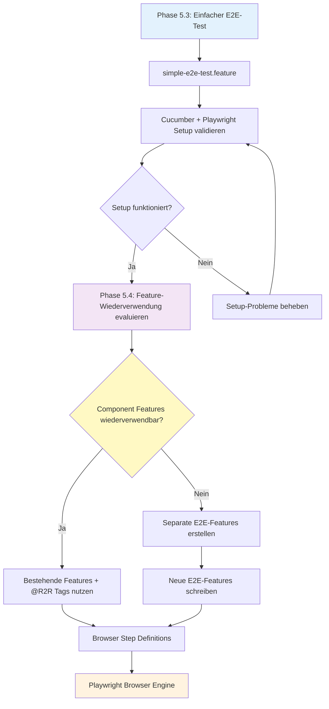

# Implementation Plan: Umstrukturierung der Test-Suite (CONSOLIDATED)

## Metadata

- **Story ID**: ACME-TEST-REFACTORING
- **Created**: 2025-08-10
- **Updated**: 2025-09-02 (Consolidated with ACME-001)
- **Status**: IN_PROGRESS (Phase 5)
- **Version**: 3.0 (konsolidiert + Cucumber-E2E-Erweiterung)
- **Developer**: Roo (AI Agent)

## Business Context

### Business Value

Die Umstrukturierung der Test-Suite reduziert den hohen Wartungsaufwand der bestehenden T2R-(Test-to-Real) und R2R-(Real-to-Real) Tests. Dies führt zu einer stabileren, schnelleren und zuverlässigeren CI/CD-Pipeline, erhöht das Vertrauen des Entwicklungsteams in die Tests und beschleunigt somit zukünftige Feature-Entwicklungen.

### Feature Description

Die bestehende Teststrategie wird in drei klare Säulen gegliedert unter Verwendung von **Cucumber für alle Test-Ebenen** gemäß ADR-02. Dieses Dokument beschreibt die inkrementelle Umstellung, Komponente für Komponente, beginnend mit der Ablösung aller T2R-Tests durch fokussierte Adapter-Integrationstests. Anschließend werden die R2R-Tests durch **Cucumber-basierte E2E-Tests** mit Playwright als Execution Engine ersetzt.

### Acceptance Criteria

- [x] AC1: Alle T2R-Tests der Komponenten `musicplayer`, `users`, und `scoreboard` sind durch fokussierte, wartungsarme Adapter-Integrationstests ersetzt.
- [x] AC2: Die zugehörigen `CucumberT2RConfiguration`-Klassen sind nach erfolgreicher Migration aus den Komponenten entfernt.
- [ ] AC3: Alle R2R-Tests sind durch stabile **Cucumber-E2E-Tests** ersetzt, die in einem dedizierten `e2e`-Maven-Modul leben.
- [ ] AC4: **Feature-Wiederverwendung validiert**: Nach erstem E2E-Test evaluiert, ob bestehende `.feature`-Dateien für E2E-Tests wiederverwendbar sind oder separate E2E-Features benötigt werden.
- [ ] AC5: Die neuen Tests laufen erfolgreich als Teil der CI/CD-Pipeline.
- [ ] AC6: Die Code Coverage DARF NICHT geringer werden (Instruction-, Line- und Branch-Coverage jeweils ≥ Baseline).
- [ ] AC7: **API-Tests** mit `@WebMvcTest` sind als separater Phase implementiert und dokumentiert.

## Technical Analysis

### Architecture Alignment

- **Domain**: `musicplayer`, `users`, `scoreboard`
- **Use Cases**: Primär Refactoring der Test-Schichten, keine Änderung an der Geschäftslogik.
- **Adapters Required**: `LiedRepository`, `BenutzerRepository`, `UserScoreBoardRepository`, etc.
- **Documentation to Review**:
    - [x] @/documentation/componenttesting.adoc
    - [x] @/documentation/ADRs/02-testing-framework.adoc
    - [x] @/README.adoc

### Dependencies

- **External Systems**: PostgreSQL-Datenbank. Wird in Tests durch Testcontainers verwaltet.
- **Internal Components**: Keine direkten, da die Adapter isoliert getestet werden.
- **New Libraries**: `org.testcontainers`, `io.playwright`, `io.cucumber:cucumber-junit-platform-engine`

## Implementation Steps

### Phase 1: Gemeinsame Test-Infrastruktur ✅

```
INSTRUCTION: Erstelle eine wiederverwendbare Basis für alle Adapter-Integrationstests.
```

- [x] **Step 1.1**: Eine zentrale, wiederverwendbare Testkonfiguration für Adapter-Integrationstests im `services/acme`-Modul schaffen (z.B. eine abstrakte Basisklasse). Diese soll die Verwaltung von Testcontainern (PostgreSQL) standardisieren.
- [x] **Step 1.2**: Einen ersten Adapter-Integrationstest für das `LiedRepository` (aus der `musicplayer`-Komponente) unter Verwendung von `@DataJpaTest` und der neuen Testcontainer-Konfiguration erstellen, um die Infrastruktur zu validieren. Dieser dient als Blaupause.

### Phase 2: Umstellung der Komponente 'musicplayer' ✅

```
INSTRUCTION: Ersetze alle T2R-Tests der musicplayer Komponente.
```

- [x] **Step 2.1**: Alle weiteren T2R-Tests der `musicplayer`-Komponente schrittweise durch fokussierte Adapter-Integrationstests ersetzen.
- [x] **Step 2.2**: Temporär die alten T2R-Tests mit `@Disabled` markieren, während der neue Test geschrieben wird, um eine kontinuierliche Testabdeckung zu gewährleisten.
- [x] **Step 2.3**: Nachdem alle T2R-Tests der Komponente ersetzt wurden, die alte Test-Infrastruktur löschen:
    - [x] `services/acme/src/test/java/de/acme/musicplayer/componenttests/musicplayer/test2real/`
- [x] **Step 2.4**: Überprüfen, dass `mvn clean verify` für das Modul weiterhin erfolgreich ist.

### Phase 3: Umstellung der Komponente 'users' ✅

```
INSTRUCTION: Wiederhole den Prozess für die users Komponente.
```

- [x] **Step 3.1**: Alle T2R-Tests der `users`-Komponente schrittweise durch fokussierte Adapter-Integrationstests ersetzen (z.B. für `BenutzerRepository`).
- [x] **Step 3.2**: Nachdem alle T2R-Tests der Komponente ersetzt wurden, die alte Test-Infrastruktur löschen:
    - [x] `services/acme/src/test/java/de/acme/musicplayer/componenttests/users/test2real/`
- [x] **Step 3.3**: Überprüfen, dass `mvn clean verify` für das Modul weiterhin erfolgreich ist.

### Phase 4: Umstellung der Komponente 'scoreboard' ✅

```
INSTRUCTION: Schließe die T2R-Migration mit der scoreboard Komponente ab.
```

- [x] **Step 4.1**: Alle T2R-Tests der `scoreboard`-Komponente schrittweise durch fokussierte Adapter-Integrationstests ersetzen (z.B. für `UserScoreBoardRepository`).
- [x] **Step 4.2**: Nachdem alle T2R-Tests der Komponente ersetzt wurden, die alte Test-Infrastruktur löschen:
    - [x] `services/acme/src/test/java/de/acme/musicplayer/componenttests/scoreboard/test2real/`
- [x] **Step 4.3**: Überprüfen, dass `mvn clean verify` für das Modul weiterhin erfolgreich ist.

### Phase 5: R2R → Cucumber-E2E Migration (CURRENT)

```
INSTRUCTION: Ersetze die R2R-Tests durch Cucumber-basierte E2E-Tests.
```

- [x] **Step 5.1**: Ein dediziertes, separates Maven-Modul `e2e` erstellen.
- [ ] **Step 5.2**: **Cucumber-Playwright Integration** - Cucumber- und Playwright-Abhängigkeiten in das `e2e`-Modul hinzufügen:
  - `io.cucumber:cucumber-java`
  - `io.cucumber:cucumber-junit-platform-engine`
  - `com.microsoft.playwright:playwright`
- [ ] **Step 5.3**: **Ersten einfachen E2E-Test implementieren** - Erstelle eine neue, einfache E2E-Feature-Datei um das Cucumber+Playwright Setup zu validieren:
  - `e2e/src/test/resources/features/simple-e2e-test.feature`
  - Einfacher Browser-Test (z.B. "Homepage laden und Titel prüfen")
  - Browser-basierte Step Definitions mit Playwright
- [ ] **Step 5.4**: **Feature-Wiederverwendung evaluieren** - Nach erfolgreichem ersten E2E-Test prüfen:
  - Können bestehende Component-Test `.feature`-Dateien für E2E wiederverwendet werden?
  - Funktionieren `@R2R`-Tags mit unterschiedlichen Step-Implementierungen?
  - **ENTSCHEIDUNG**: Wiederverwendung ODER separate E2E-Feature-Dateien erstellen
- [ ] **Step 5.5**: Die neuen E2E-Tests in die CI/CD-Pipeline integrieren.

### Phase 6: API-Tests mit @WebMvcTest (NEW)

```
INSTRUCTION: Implementiere dedizierte Controller-Tests für REST-Endpunkte.
```

- [ ] **Step 6.1**: **Controller identifizieren** - Alle REST-Controller in `adapters/web/` analysieren
- [ ] **Step 6.2**: **Ersten @WebMvcTest implementieren** - Beginne mit einem einfachen GET-Endpunkt
- [ ] **Step 6.3**: **MockBean-Dependencies** - Service-Layer mit `@MockBean` mocken
- [ ] **Step 6.4**: **HTTP-Validierung** - Status, Header und Response-Body validieren
- [ ] **Step 6.5**: **POST/PUT-Tests** - Request-Bodies und Fehlerfälle (400 Bad Request) testen
- [ ] **Step 6.6**: **Security-Tests** - CSRF, Authorization Headers, Input Validation

### Phase 7: Bereinigung und Abschluss

```
INSTRUCTION: Schließe das Refactoring ab.
```

- [ ] **Step 7.1**: Die alte `real2real`-Testinfrastruktur (`services/acme/src/test/java/de/acme/musicplayer/componenttests/real2real/`) vollständig löschen.
- [ ] **Step 7.2**: Ein finales Review der gesamten Test-Suite durchführen und sicherstellen, dass keine verwaisten Konfigurationen oder Tests zurückgeblieben sind.
- [ ] **Step 7.3**: Das neue Testkonzept und die umgesetzte Struktur im Team vorstellen und die Projektdokumentation (`componenttesting.adoc`) aktualisieren.

## Quality Checkpoints & Definition of Done

### Test Coverage Baseline (Stand: 2025-08-29)

- Quelle: JaCoCo Report unter [jacoco.csv](services/acme/target/site/jacoco/jacoco.csv)
- Gesamtabdeckung (services/acme):
  - Instruction: 83.37% (1512/1814)
  - Branch: 73.33% (22/30)
  - Line: 83.55% (345/413)
- Testlauf: 65 Tests (0F/0E/0S), BUILD SUCCESS, Report: [index.html](services/acme/target/site/jacoco/index.html)

### Coverage Policy (verbindlich)

- Die Code Coverage DARF NICHT geringer werden während des Refactorings.
- Gilt für Instruction-, Line- und Branch-Coverage (mindestens gleichbleibend, idealerweise steigend).
- Quality Gate: Ein Schritt gilt erst als erledigt, wenn die Coverage mindestens dem obigen Baseline-Stand entspricht.

## Cucumber-E2E Test-Architektur

### E2E-Test-Setup-Validierung



### E2E-Test-Struktur

```
e2e/
├── src/test/java/de/acme/e2e/
│   ├── steps/
│   │   ├── SimpleE2ESteps.java        # Erste Validierungs-Steps
│   │   └── (weitere nach Evaluation)  # Browser-basierte Steps
│   ├── support/
│   │   ├── PlaywrightSupport.java     # Browser-Management
│   │   └── TestDataSupport.java       # E2E-Testdaten
│   └── CucumberE2ETest.java           # Test Runner
└── src/test/resources/features/
    ├── simple-e2e-test.feature        # Erstes Setup-Validierungs-Feature
    └── (weitere nach Evaluation)      # Nach Feature-Wiederverwendungs-Entscheidung
```

## Progress Tracking

### Current Status

- **Current Phase**: Phase 5 - R2R → Cucumber-E2E Migration
- **Current Step**: Step 5.2 - Cucumber-Playwright Integration
- **Blockers**: None
- **Questions**: None

### Deviation Log

- **Step**: 3.3
- **Reason**: TenantId-Cookie-Validierungstests erwarten 4xx-Fehler, aber Controller implementieren diese Validierung nicht
- **Proposed Change**: Tests wurden teilweise korrigiert (HTMX-Header-Tests, JSON-Serialisierung, Mockito-Argument-Matching), aber 3 TenantId-Cookie-Tests benötigen weitere Anpassung
- **Impact**: GELÖST am 2025-08-29 – alle Tests grün; kein Folge-Impact
- **Resolution**: Anpassungen umgesetzt; Verifikation via ./mvnw -pl services/acme -am clean verify (BUILD SUCCESS)

### Coverage Status (aktuell)

- Instruction: 83.37% (1512/1814)
- Branch: 73.33% (22/30)
- Line: 83.55% (345/413)
- Report: [index.html](services/acme/target/site/jacoco/index.html)

### Completion Log

| Phase   | Completed | Duration | Notes |
|---------|-----------|----------|-------|
| Phase 1 | ✅         | 45min    | Gemeinsame Test-Infrastruktur erfolgreich etabliert |
| Phase 2 | ✅         | 1h 30min | Musicplayer-Komponente erfolgreich migriert |
| Phase 3 | ✅         | 1h 25min | Users: test2real entfernt; mvn verify grün; Coverage-Baseline gehalten |
| Phase 4 | ✅         | 20min    | Scoreboard: Adapter-IT vorhanden; keine test2real-Altlasten; Build grün |
| Phase 5 | 🔄         | -        | **CURRENT**: Cucumber-E2E Migration mit Feature-Wiederverwendung |
| Phase 6 | ⬜         | -        | API-Tests (@WebMvcTest) |
| Phase 7 | ⬜         | -        | Bereinigung und Abschluss |

## Archivierung von ACME-001

**Status**: SUPERSEDED by ACME-TEST-REFACTORING-CONSOLIDATED  
**Reason**: Duplikation der Ziele; ACME-TEST-REFACTORING war bereits in Phase 5  
**Action**: ACME-001 wird zu `/documentation/plans/archived/` verschoben  

---
*This consolidated plan follows TDD, Clean Code, Cucumber-first testing, and ACME architecture principles strictly.*